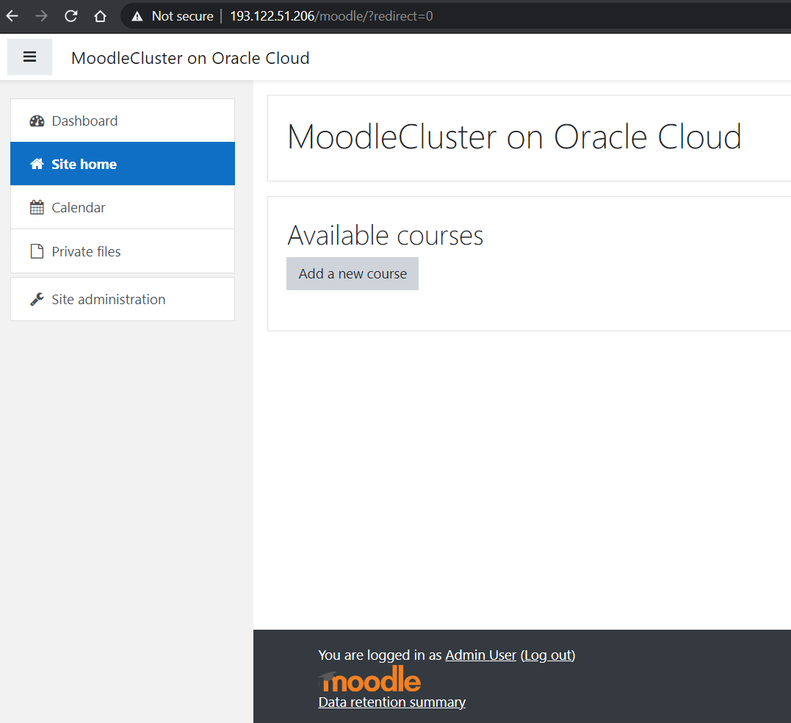

# Moodle Cluster on OCI with MySQL database service

The this architecture contains a public load balancer, two moodle application server on Apache, two read-write shareable storages for html files, and a database tier with MySQL Database Service.

### Architecture Review
- A virtual cloud network with a public and a private subnet to avoid direct access from the public internet, hence you will have a public load balancer. Because you will not want to expose your application servers, just a thought.
- Your application servers will run in the private network 
- Two read-write shareable block storages for your cluster files.
- MySQL, enterprise-level database cloud service running on OCI in the private subnet.
- A bastion server will grant your access wish to your application servers and MySQL Database service.

## Deploy using Resource Manager

1. If you have your cloud tenancy running ready and ready to start with this deployment on using resource manager stack, which is automated terraform manager [click here](https://cloud.oracle.com/resourcemanager/stacks/create?region=home&zipUrl=https://github.com/hol-workshop/moodle/archive/main.zip) and will re-direct you to OCI.
2. Login to your Oracle cloud tenancy with appropriate credentials.
3. Review and accept [Oracle Terms of Use](https://cloudmarketplace.oracle.com/marketplace/content?contentId=50511634&render=inline).
4. Enter a name for this deployment and choose target compartment, then click next
5. 
6. Follow the on-screen prompts and instructions to create the stack.
7. After creating the stack, click Terraform Actions, and select Plan.
8. Wait for the job to be completed, and review the plan.
9. To make any changes, return to the Stack Details page, click Edit Stack, and make the required changes. Then, run the Plan action again.
If no further changes are necessary, return to the Stack Details page, click Terraform Actions, and select Apply.

### Clone to your local machine
If you want to run this terraform from your local machine, use below commands to clone it.

    git clone https://github.com/hol-workshop/moodle.git
    cd moodle
    ls

### Environment parameters

    variable "tenancy_ocid" {}
    variable "region" {}
    variable "compartment_ocid" {}

#### Create the Resources

Once you are in your downloaded diretory, run the following commands:

    terraform init
    terraform plan
    terraform apply

# Test

Now it's time to check your connectivity.
Open your web browser and enter output of Moodle_LB_IP_address slash moodle. 

For example following was my output:
-   http://193.122.51.206/moodle

You will have to simply follow wizard here and update some parameters:

- Database host, this is your MysqlDB_Private_IP output
- Database name, moodle
- Database user, moodle
- Database password, MoodleAdm1n_
- Tables prefix, mdl_
- Datbabase port, 3306

It will take you 1-2 mins for completing wizard and you will have fully working moodle environment afterwards. Goodluck!

